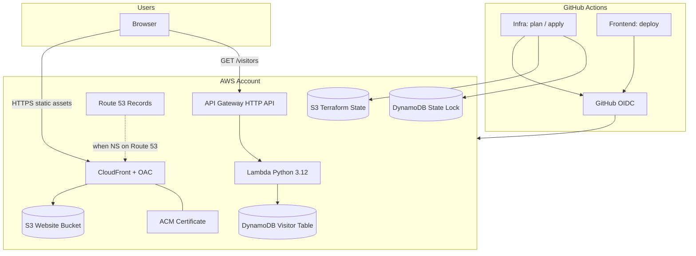

# Cloud Resume Challenge — Architecture

Stephen McKitrick · [Live site](https://stephenmckitrick.com) · [Frontend repo](https://github.com/Bigessfour/CloudResumeChallenge-frontend) · [Infra repo](https://github.com/Bigessfour/CloudResumeChallenge-infra)

## Overview

Production AWS hosting for a static resume portfolio with a serverless visitor counter, managed entirely with Terraform and deployed via GitHub Actions OIDC (no long-lived AWS access keys in CI).



## Repository split

| Repo | Responsibility |
|------|----------------|
| **CloudResumeChallenge-infra** | Bootstrap (state, OIDC), prod stack (S3, CloudFront, DNS, ACM, API, Lambda, DynamoDB) |
| **CloudResumeChallenge-frontend** | Static HTML/CSS/JS, Syncfusion EJ2, CI linting, S3 sync + CloudFront invalidation |

## Bootstrap (`bootstrap/`)

One-time (or rare) setup using local AWS credentials:

- **S3** — remote Terraform state (`cloudresume-tfstate-*`)
- **DynamoDB** — state locking (`cloudresume-tf-locks`)
- **IAM OIDC** — GitHub Actions can assume `github-actions-cloudresume-terraform`
- **IAM policy** — scoped permissions for Terraform, website deploys, and serverless resources

## Production stack (`environments/prod/`)

| Component | Implementation | Security notes |
|-----------|----------------|----------------|
| Static site | Private S3 bucket + CloudFront OAC | No public bucket access; only CloudFront can read objects |
| HTTPS | ACM cert in `us-east-1` (CloudFront requirement) | DNS validation via Route 53 records |
| Custom domain | `stephenmckitrick.com` + `www` redirect | CloudFront Function redirects www → apex |
| Visitor counter | API Gateway HTTP API → Lambda → DynamoDB | Atomic `ADD` increment; CORS limited to site origins |
| DNS (current) | Porkbun nameservers | Route 53 records exist for future NS cutover (~60 days) |

### Visitor counter flow

1. Browser loads resume from CloudFront.
2. `app.js` calls `GET {VISITOR_API_URL}` (injected via `js/config.js` at deploy time).
3. Lambda runs `UpdateItem` with `ADD hits :incr` on DynamoDB.
4. JSON `{ "count": N }` returned; UI updates the Syncfusion pill button.

## CI/CD

### Infra repo workflows

| Workflow | Trigger | Action |
|----------|---------|--------|
| `terraform-plan.yml` | PR touching Terraform | `fmt`, `validate`, `plan`, PR comment |
| `terraform-apply.yml` | Push to `main` | `terraform apply` to prod |

GitHub **repository / environment variables**: `AWS_ROLE_ARN`, `AWS_REGION`.

### Frontend repo workflows

| Workflow | Trigger | Action |
|----------|---------|--------|
| `ci.yml` | PR + push | ESLint, HTMLHint, Prettier, structure checks |
| `deploy.yml` | Push to `main` | Generate license + config, S3 sync, CloudFront invalidation |

GitHub **variables**: `AWS_ROLE_ARN`, `AWS_REGION`, `S3_BUCKET_NAME`, `CLOUDFRONT_DISTRIBUTION_ID`, `VISITOR_API_URL`  
GitHub **secret**: `SYNCFUSION_LICENSE_KEY`

## Secrets handling

| Secret | Where stored | Never committed |
|--------|--------------|-----------------|
| Syncfusion license | GitHub secret → generated `js/syncfusion-license.js` at deploy | ✓ |
| Visitor API URL | GitHub variable → generated `js/config.js` at deploy | ✓ |
| AWS credentials | GitHub OIDC → temporary STS creds | ✓ |
| Terraform tfvars | Local only (gitignored) | ✓ |

Static sites cannot fetch secrets at runtime from AWS Secrets Manager — license and API URL are baked into deploy artifacts intentionally.

## Cost estimate (Free Tier friendly)

| Service | Typical monthly cost |
|---------|---------------------|
| S3 + CloudFront | $0–1 (low traffic) |
| Lambda + API Gateway | $0 (within free tier) |
| DynamoDB on-demand | $0 (single counter item) |
| Route 53 hosted zone | ~$0.50/month (already created) |
| ACM | Free |

## Operational runbook

### Deploy infrastructure change

```bash
cd environments/prod
terraform plan
terraform apply
```

Or merge a PR to `main` in the infra repo.

### Deploy frontend change

Push to `main` in the frontend repo (GitHub Actions deploy workflow), or manually:

```bash
npm run syncfusion:license   # requires SYNCFUSION_LICENSE_KEY
aws s3 sync . s3://stephenmckitrick-resume --delete [excludes...]
aws cloudfront create-invalidation --distribution-id E1VI8ZZ8L1HW1F --paths "/*"
```

### After Terraform apply — update frontend `VISITOR_API_URL`

```bash
terraform output -raw visitor_api_url
```

Set that value as the `VISITOR_API_URL` repository variable in the frontend GitHub repo.

## Lessons learned (portfolio narrative)

1. **ACM + Porkbun** — Validation CNAMEs must be on the authoritative DNS provider; duplicated hostname in Porkbun UI broke validation until fixed.
2. **Bootstrap OIDC** — Eliminates static AWS keys in GitHub; IAM policy grows with stack (Lambda/API permissions added for visitor counter).
3. **OAC over public S3** — Industry-standard pattern for static sites; bucket stays private.
4. **Split repos** — Mirrors real teams: platform infra vs application delivery.

## Related outputs

After `terraform apply` in `environments/prod/`:

- `website_url` — primary site URL
- `visitor_api_url` — set as frontend `VISITOR_API_URL`
- `cloudfront_distribution_id` — frontend deploy + invalidations
- `s3_bucket_name` — frontend S3 sync target
